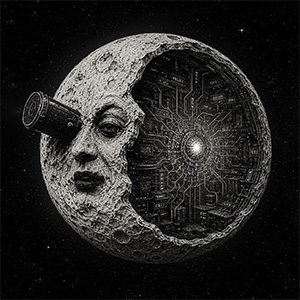

<p align="center"></p>

# AI VFX Feed MCP

An MCP server that gives any AI agent searchable access to the **AI VFX** news pipeline (`@AI_VFX_NEWS`) and, more
importantly, to the **code and models behind each story**. A coding agent can ask "what's new in video models" and
get back not just headlines but the GitHub repo, the Hugging Face model with its license, size and quantizations,
and the arXiv paper, then fetch them and try them.

It is the same semantic search the project's search bot uses, exposed over the open
[Model Context Protocol](https://modelcontextprotocol.io) so it works with Claude, Gemini, Codex, or anything else
that speaks MCP. API is API.

## What it does

- **`search_feed(query, top_k=8)`** — semantic search over the published-posts archive (Qdrant + nomic-embed).
  Each result carries `title`, `summary`, `source_url`, `tg_url`, and the resolved artifacts: `github`,
  `hf_model`, `hf_quants`, `license`, `model_size_gb`, `arxiv`.
- **`latest(n=10)`** — the newest items, same shape.
- **`install_plan(github, hf_model, hf_quants)`** — turns an item's artifacts into ready-to-run commands
  (`git clone …`, `huggingface-cli download …`). The calling agent runs them under its own rules.
- **`resolve_artifacts(name, text)`** — on-demand resolver for items not pre-resolved: finds the GitHub repo, the
  Hugging Face model (license/size) and its quantizations, arXiv → code via Papers with Code, and a docs link.
- **`read_docs(url, max_chars=20000)`** — fetch readable text (GitHub/HF README, arXiv, docs page) so an agent can
  implement a technique even when there is no runnable repo.

The feed is kept fresh by the pipeline, so reads are offline-friendly and put zero load on the running bot.

## How the artifacts are found

Links already in a post win. Anything missing is resolved by name behind a confidence floor:

- **GitHub:** `api.github.com/search/repositories`, ranked by name match + stars.
- **Hugging Face:** `huggingface.co/api/models` for the model (license, file sizes) plus its quantizations
  (GGUF / AWQ / GPTQ / FP8).
- **arXiv → code:** Papers with Code, preferring the official repo.

If nothing matches confidently, the field is left empty. Better empty than wrong.

## Install

```bash
pip install -e .        # or: pip install -r requirements.txt
```

Needs a reachable Qdrant (the pipeline's `published_posts` collection) and Ollama for query embedding.

## Configure your agent

Stdio server — the command is the same for every MCP client.

**Claude Code:**
```bash
claude mcp add ai-vfx-feed -- python -m aivfx_mcp.server
```

**Generic MCP client config** (Claude Desktop, and the analogous file for other agents):
```json
{
  "mcpServers": {
    "ai-vfx-feed": {
      "command": "python",
      "args": ["-m", "aivfx_mcp.server"],
      "env": {
        "QDRANT_URL": "http://localhost:6333",
        "OLLAMA_URL": "http://localhost:11434",
        "FEED_COLLECTION": "published_posts",
        "GITHUB_TOKEN": ""
      }
    }
  }
}
```

## Environment

| Var | Default | Purpose |
|---|---|---|
| `QDRANT_URL` | `http://localhost:6333` | Qdrant holding the feed |
| `OLLAMA_URL` | `http://localhost:11434` | Ollama for query embeddings |
| `FEED_COLLECTION` | `published_posts` | Qdrant collection name |
| `EMBED_MODEL` | `nomic-embed-text` | Embedding model (must match the index) |
| `GITHUB_TOKEN` | — | Optional, raises GitHub search rate limit |

## Safety

Installing code or models from a feed means running untrusted artifacts. This server only **hands over** verified
links and exact commands; it never installs anything. Downloading and running is the consuming agent's
responsibility — inspect first, gate behind approval, run isolated, and watch model sizes against your disk/VRAM.

## Tests

```bash
python -m pytest -q
```

Built solo by Slava Sexton — part of the AI VFX autonomous pipeline.
